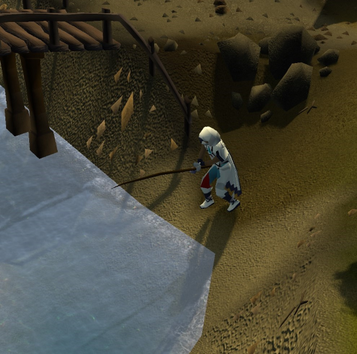

# StickToTheScript's Barbarian Village Fisher

The **Barbarian Village Fisher Script** automatically fishes at the fishing spots in Barbarian Village, with support for cooking and banking.

---

## Features

| Feature                         | Description                                 |
|---------------------------------|---------------------------------------------|
| **Multiple Fishing Techniques** | Can fish using bait or fly fishing methods. |
| **Cooking Support**             | Support for cooking all types of fish.      |
| **Banking**                     | Bank fish at Edgeville Bank if desired.     |
| **Dropping**                    | Drop raw or cooked fish if desired.         |

---

## Requirements
- Microbot RuneLite client
- Required bait or fly fishing equipment in the inventory.
- Player is in Barbarian Village.

---

## Configuration Options
- **Fish Type**: The type of fishing to perform: Fly Fishing or Bait Fishing.
- **Function**: What to do after a full inventory of fish is caught. The fish can be dropped, banked, cooked and dropped, or cooked and banked.
- **Debug**: Enable/disable the debug entry in the overlay. This is helpful for gathering additional information when bugs occur.

---

## Disclaimer
This script is intended for use within the **Microbot RuneLite Client** only.  
Use of automation software in Old School RuneScape is against Jagex’s rules and can result in penalties to your account.  
Use at your own risk.

---

## Changelog

### 1.0.0
- Initial Release
### 1.0.1
- Add PNG icon