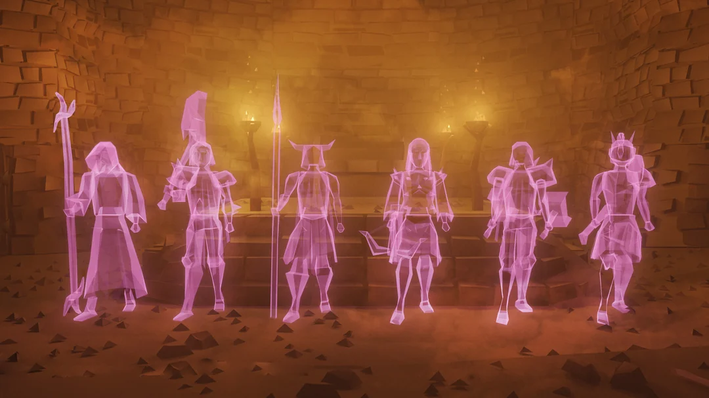

# Barrows Brothers

Completes the Barrows Brothers Mini-Game.

## Features
- Supports wind spells and powered staffs
- Moonlight Moths
- Anti Pattern
- Scheduling
- POH
- And more!

## Requirements
1. A powered staff or catalytic runes for wind spells.
2. Full completion of His Faithful Servants mini quest.
3. Prayer restore method. (Potions or moths)
4. Barrows teleport tablets, or POH tablets.
5. Rings of dueling
6. A spade.
7. Food.

## Setup
1. Install and enable the plugin in your client.
2. Configure your inventory setup for Barrows.
3. Adjust plugin settings to match your preferences.

## Usage Tips
- The plugin will eat food and drink energy potions at the bank if configured.
- For best results, use the deposit all feature with inventory slot locking to avoid losing important items.
- Overlay and profit calculator can be toggled in the settings.

## Troubleshooting
- If the script is sitting idle at the bank. Chances are you're missing an item or your inventory setup.
- If all else fails; feel free to ask away in the Barrows thread in discord. 