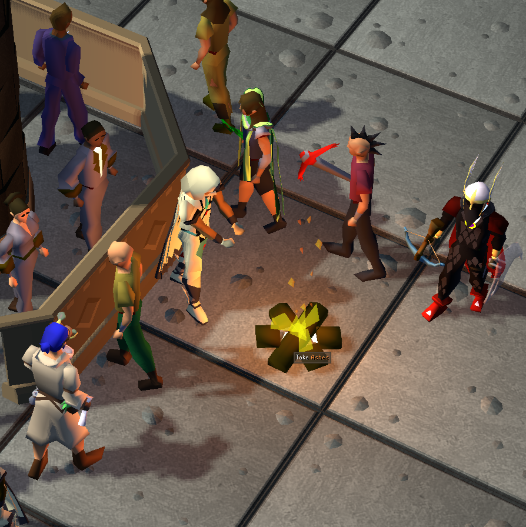

# StickToTheScript's Grand Exchange Firemaker

The **Grand Exchange Firemaker Script** automates burning logs in the Grand Exchange.

---

## Features

| Feature                  | Description                                                                                 |
|--------------------------|---------------------------------------------------------------------------------------------|
| **All Log Types**        | Supports burning all log types.                                                             |
| **Finds Existing Fires** | If a fire already exists in the specified location, it will automatically use the campfire. |

---

## Requirements
- Microbot RuneLite client
- Logs and tinderbox in the bank.
- Player is in the Grand Exchange.

---

## Configuration Options
- **Log Type**: The type of log to burn.
- **Location**: The desired primary location around the center of the Grand Exchange to use.
- **Debug**: Enable/disable the debug entry in the overlay. This is helpful for gathering additional information when bugs occur.

---

## Disclaimer
This script is intended for use within the **Microbot RuneLite Client** only.  
Use of automation software in Old School RuneScape is against Jagex’s rules and can result in penalties to your account.  
Use at your own risk.

---

## Changelog
### 1.0.1
- Add PNG icon

### 1.0.0
- Initial Release