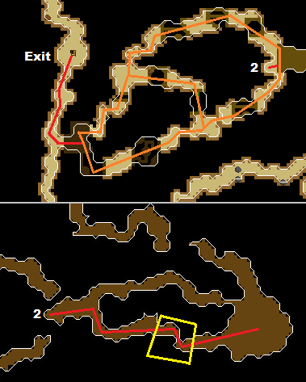

# Monkey Madness II Caves Plugin

The **Monkey Madness II Caves Plugin** provides an automated way to **throw chins** or **cast AOE magic spells** in the Monkey Madness II caverns.

---

## 📍 Starting Position & Aggro reset Location

Start at the tile marked with **`2`**.  
The aggro reset area is highlighted with yellow lines.

---

## ✨ Features

- Supports **Chinning** and **Bursting/Barraging**, with optional **Custom Attack Delay**
- Automatically resets aggro
- Attack delay handling:
    - **Custom delay** (user-defined)
    - **Mode-based defaults**:
        - Chinning → `1800ms` (~3 ticks)
        - Bursting → `3000ms` (~5 ticks)
- Auto-casting or manual spell casting depending on configuration

---

## ⚙️ Configuration

| Setting              | Description                                                                 |
|-----------------------|-----------------------------------------------------------------------------|
| **Use Custom Delay**  | Enable to set your own attack delay (ms).                                   |
| **Custom Delay**      | Milliseconds between attacks (e.g., `3100`).                               |
| **Mode**              | `MAGIC` or `RANGE` – sets the default delay.                               |
| **Auto Cast**         | If enabled, the plugin will cast the configured spell on the target.        |
| **Magic Spell**       | Spell to be used when auto casting.                                         |

---

## 🗺️ How It Works

1. Start on the tile marked **`2`** inside the cave.
2. The script checks if the cavern is empty; if not, it will world hop.
3. Walk to the training area.
4. Attack using **chinchompas** or **magic**.
5. Move between tiles to stack monkeys efficiently.
6. If the player runs out of required runes or chinchompas, the plugin will return to the starting spot and log out.

---

## 📋 Requirements

- A **light source** in your inventory
- **Monkey Madness II** quest completed (access to caves)
- Proper gear equipped:
    - Chinchompas or runes for your spell
    - At least **1 prayer potion**
    - (No gear management is handled by the plugin)

---

## ⚠️ Notes

- Do **not** run this plugin unattended for extended periods.
- Always monitor for unexpected behavior or issues.  
