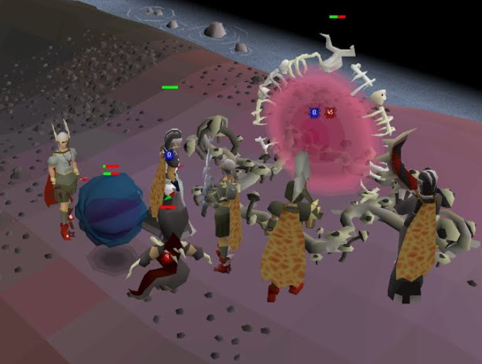

# Pest Control Script – Microbot RuneLite Client

The **Pest Control Script** automates the Old School RuneScape Pest Control mini-game using the Microbot RuneLite client.  
It handles everything from gearing up to fighting portals and NPCs, ensuring continuous participation in games for maximum points.

---

## Features

## Feature Overview

| Feature                   | Description                                                                 |
|---------------------------|-----------------------------------------------------------------------------|
| **Auto World Hop**        | Hops to your configured Pest Control world before starting.                 |
| **Travel to Island**      | Walks to the Pest Control island if not already there.                      |
| **Inventory Setup**       | Loads gear and inventory from a predefined Microbot setup.                  |
| **Boat Selection**        | Boards the correct boat based on your combat level.                         |
| **Quick Prayer**          | Automatically enables Quick Prayer at game start (optional).                |
| **Special Attack**        | Uses special attack when above configured energy threshold.                  |
| **Target Priority**       | Customizable attack order: Brawlers, Portals, Spinners.                      |
| **Portal Targeting**      | Finds and attacks closest active portal without shield.                      |
| **Combat Idle Handling**  | Attacks nearby NPCs when idle.                                               |
| **Brawler Blocking Fix**  | Attacks brawlers if they block movement.                                     |
| **Boat Alching**          | High-alchs a chosen item while waiting in the boat (optional).               |
| **Error Handling**        | Catches exceptions and prevents script crashes.                              |
| **Fast Loop**             | Runs every 300 ms for near real-time responses.                              |
| **Automatic Requeue**     | Re-boards the correct boat after each game.                                  |

---

## Requirements
- Microbot RuneLite client
- Properly configured **inventory setup** in Microbot
- Pest Control world access

---

## Configuration Options
- **World**: Target world to play on.
- **Inventory Setup**: Predefined gear & inventory configuration.
- **Quick Prayer**: Enable/disable Quick Prayer usage.
- **Special Attack Percentage**: Energy threshold for using special attacks.
- **Target Priority**: Set the attack order for Brawlers, Portals, and Spinners.
- **Alching in Boat**: Enable/disable high-alching between matches.
- **Alch Item**: Name of item to alch.

---

## How It Works
1. The script checks if you are logged in and on the right world.
2. If needed, it hops worlds and travels to the Pest Control island.
3. Loads gear and inventory from the configured setup.
4. Boards the correct boat based on your combat level.
5. During games:
    - Moves to the center.
    - Activates prayers and special attacks as configured.
    - Attacks NPCs or portals based on your chosen priorities.
6. After games, it queues up for the next round automatically.

---

## Disclaimer
This script is intended for use within the **Microbot RuneLite Client** only.  
Use of automation software in Old School RuneScape is against Jagex’s rules and can result in penalties to your account.  
Use at your own risk.

