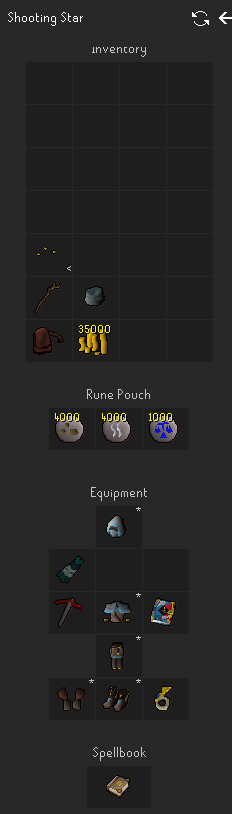

# Shooting Star Plugin

Shooting stars are a world event in Old School RuneScape, where players can mine fallen stars for rewards and experience. This plugin helps you efficiently locate and mine shooting stars by integrating with multiple star location providers and automating navigation.

## Features
- **Multiple Star Providers**: Choose from multiple sources for star locations. The plugin will automatically switch to another provider if one is unavailable.
- **Custom Inventory Setups**: Configure your own inventory, including pickaxes, teleports, and other useful items.
- **Web Walker Integration**: Automatically finds the closest available star and navigates your character there.
- **Antiban Support**: Uses Microbot's antiban system for safer, more human-like behavior.
- **Automatic Provider Switching**: If a star provider is down, the plugin will try the next one.
- **Flexible Configuration**: Adjust settings to match your preferred mining style.

## Setup
1. Make sure you have Microbot and this plugin installed.
2. Configure your inventory setup (see below for an example).
3. Select your preferred star provider in the plugin settings.
4. For fully automated pathfinding & mining, enable the "Use Nearest High Tier Star" option.
5. Enable the Shooting Star Plugin in your client.

### Example Inventory Setup

This example setup leverages combination runes in a rune pouch. It's recommended to use teleport spells, tablets or scrolls instead of charged jewelry to avoid excessive bank trips.

Adding coins into your inventory setup is optional, but allows for the use of boats & charters.

Export of example setup: [example-inventory-setup.json](assets/example-inventory-setup.json)

## Troubleshooting / FAQ
- **The plugin isn't finding stars:** Make sure you have a reasonable mining level and that you have configured an inventory setup.
- **Pathfinding issues:** Check your Web Walker settings and ensure you have configured your inventory setup to have adequate teleports or runes.
- **Other issues:** Try restarting your client, check for plugin updates, or create an issue on the microbot-hub repository.

## Contributing
Pull requests and suggestions are welcome! If you find a bug or have an idea for a new feature, feel free to open an issue or submit a PR.