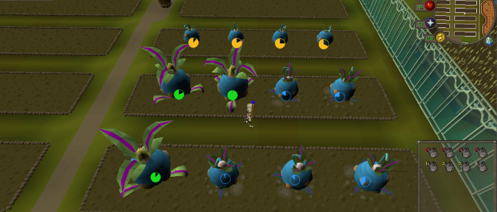

# TitheFarming Plugin

## Overview

The TitheFarming plugin automates the Tithe Farm minigame in Old School RuneScape using the Microbot framework. It efficiently plants, waters, and harvests crops, manages inventory, and optimizes farming runs for maximum points and experience.

## Features!

- **Automated Planting:** Plants seeds in the correct plots following the optimal pattern.
- **Watering Crops:** Automatically waters crops at the right intervals to prevent them from dying.
- **Harvesting:** Harvests fully grown crops and deposits them in the sack.
- **Inventory Management:** Handles seed, watering can, and crop inventory, including refilling watering cans when needed.
- **Movement Automation:** Navigates between plots and the deposit sack efficiently.
- **Error Handling:** Detects and recovers from common issues such as missing seeds or watering cans.
- **Configurable Options:** Allows customization of seed type, number of plots, and other farming preferences.

## How It Works

1. **Initialization:** Checks for required items (seeds, watering can) and sets up the initial state.
2. **Planting Phase:** Moves to each plot and plants seeds according to the configured pattern.
3. **Watering Phase:** Waters crops at the correct growth stages to ensure maximum yield.
4. **Harvesting Phase:** Harvests crops when fully grown and deposits them in the sack.
5. **Loop:** Repeats the process for continuous farming runs.

## Requirements

- Appropriate farming level for the selected seed.
- Seeds and a watering can in inventory.
- Access to the Tithe Farm minigame area.

## Configuration

- **Seed Type:** Choose which seed to use (Golovanova, Bologano, or Logavano).
- **Plot Count:** Set the number of plots to use (typically 5, 10, or 20).
- **Watering Preferences:** Enable or disable automatic watering.
- **Deposit Options:** Choose whether to deposit crops automatically.

## Usage

1. Place the plugin in the Microbot plugins directory.
2. Configure your preferences in the plugin settings.
3. Start the plugin from the Microbot interface.
4. The script will take over and automate the Tithe Farm minigame.

## Notes

- The plugin is designed for efficiency and reliability but may require occasional supervision.
- Ensure you have enough seeds and a watering can before starting.
- Use responsibly and in accordance with game rules.

---

For questions or issues, please contact the Microbot development team or refer to