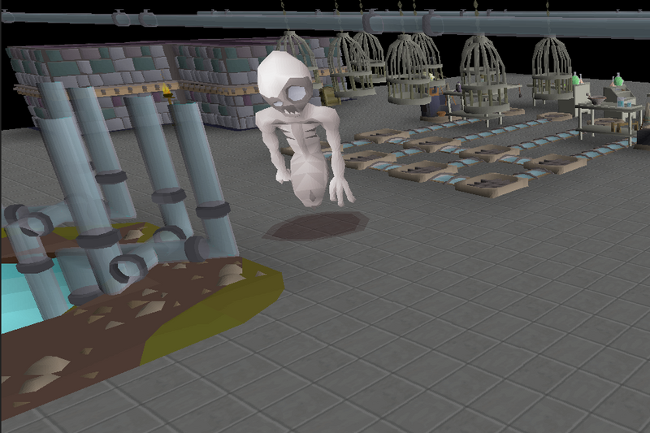

# Tower of Life - Creature Creation Plugin

The **Tower of Life - Creature Creation Plugin** provides an automated method to the creature creation process, allowing for the automated collection of red spiders' eggs and unicorn horns.

---

## Feature Overview

| Feature                              | Description                                                |
|--------------------------------------|------------------------------------------------------------|
| **Selected Creature**                | Choose an NPC to create, kill, and loot.                   |
| **Eat to Full HP at Bank**           | Eats to full HP while at the bank if wanted.               |
| **Prefer Lowest Healing Food First** | Whether it will heal to full using low healing food first. |

---

## Requirements
- Microbot RuneLite client
- Plugin enabled in the Microbot plugin list
- Tower of Life quest complete.
- Required items to create your selected creature stocked in your bank. (Cowhides & at least 1 Unicorn horn for Unicows etc.)
- Food in the bank, if using config option: Eat to Full HP at Bank.

---

## How It Works
1. Select the creature you would like to begin the creature creation process for.
2. Place your character in the Ardougne South bank.
3. Start the plugin.
4. Enjoy!

---

## Limitations
- Only has implementation for Unicows and Spidine.
- Currently only supports the use of the Ardougne South bank.
- Complete the Ardougne Medium Diary for a more efficient experience.

---

## Disclaimer & Waiver of Liability

**The Plugin is provided for educational purposes only.** By using this Plugin, you acknowledge and agree to the following:

### 1. Educational Use Only
- The Plugin is intended solely for research, learning, and understanding botting mechanics.
- It is **not** meant for active use in *Old School RuneScape (OSRS)* or any live game environment.

### 2. No Warranty
- The Plugin is provided **"as-is"** without warranties of any kind.
- Developers disclaim all liability for damages, losses, or penalties incurred through its use.

### 3. User Responsibility
- You assume **all risks** (e.g., account bans, progress loss) from using this Plugin.
- Any penalties imposed by Jagex or third parties are **your sole responsibility**.

### 4. Waiver of Claims
- You **waive all rights** to hold developers/contributors liable for any damages (direct, indirect, or consequential).

### 5. Compliance with Jagex Terms
- Automation tools violate [Jagex’s Terms of Service](https://www.jagex.com/en-GB/terms).
- Use may result in **permanent account bans**. This Plugin does **not** endorse rule-breaking.

### 6. No Affiliation
- This Plugin is **not affiliated with** Jagex Ltd. or *Old School RuneScape*.

**By using this Plugin, you confirm you have read and agreed to this disclaimer. If you disagree, cease use immediately.**

---

### Feedback
Open an issue or feel free to contribute improvements.

