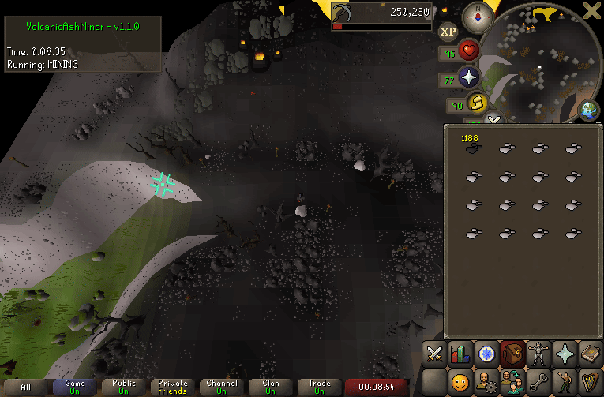

# Volcanic Ash Miner Plugin

The **Volcanic Ash Miner Plugin** provides an automated way to mine Volcanic ash.

---

## Feature Overview

| Feature                 | Description                                                   |
|-------------------------|---------------------------------------------------------------|
| **Max players in area** | If more players than this are nearby, hop worlds. 0 = disable |
| **Bank Ash**            | Whether the ash should be banked.                             |

---

## Requirements
- Microbot RuneLite client
- Plugin enabled in the Microbot plugin list

---

## How It Works
1. Have a pickaxe in your inventory or equipped.
2. Start either at the ash mine on Fossil Island or with a digsite pendant in your inventory.

---

## Disclaimer & Waiver of Liability

**The Plugin is provided for educational purposes only.** By using this Plugin, you acknowledge and agree to the following:

### 1. Educational Use Only
- The Plugin is intended solely for research, learning, and understanding botting mechanics.
- It is **not** meant for active use in *Old School RuneScape (OSRS)* or any live game environment.

### 2. No Warranty
- The Plugin is provided **"as-is"** without warranties of any kind.
- Developers disclaim all liability for damages, losses, or penalties incurred through its use.

### 3. User Responsibility
- You assume **all risks** (e.g., account bans, progress loss) from using this Plugin.
- Any penalties imposed by Jagex or third parties are **your sole responsibility**.

### 4. Waiver of Claims
- You **waive all rights** to hold developers/contributors liable for any damages (direct, indirect, or consequential).

### 5. Compliance with Jagex Terms
- Automation tools violate [Jagex’s Terms of Service](https://www.jagex.com/en-GB/terms).
- Use may result in **permanent account bans**. This Plugin does **not** endorse rule-breaking.

### 6. No Affiliation
- This Plugin is **not affiliated with** Jagex Ltd. or *Old School RuneScape*.

**By using this Plugin, you confirm you have read and agreed to this disclaimer. If you disagree, cease use immediately.**

---

## Feedback
Open an issue or feel free to contribute improvements.
