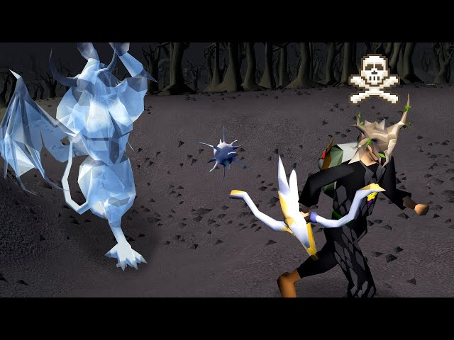

# Revenant Killer

Kills revenants in the revenant cave

## Features
- Kills: Imps, Goblins, Hobgoblins, Pyrefiends, Cyclops, Demons, Dark Beasts, Orks, and Knights
- Adjustable profit before we leave the cave
- Hop worlds based on how much time has passed
- Supports Knight safespot
- Bows, Karil's crossbow
- Anti Pattern
- Scheduling
- And more!

## Requirements
1. Stamina potions, ranging potions, sharks, rings of dueling, amulets of glory, and ammo.

## Recommended
1. Bracelets of etherium, and revenant ether. (stored in the bank)

## Setup
1. Install and enable the plugin in your client.
2. Configure your inventory setup for Revenants.
3. Adjust plugin settings to match your preferences.

## Troubleshooting
- If the script is sitting idle at the bank. Chances are you're missing an item or your inventory setup.
- If all else fails; feel free to ask away in the Rev Killer thread in discord. 